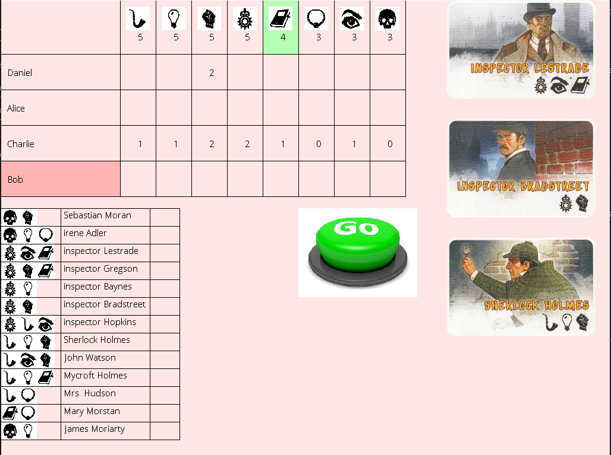

# Projet OS User

Ce projet implémente un serveur et plusieurs clients en utilisant SDL2 pour réaliser le jeu Sherlock 13.

## Prérequis

Avant de commencer, assurez-vous d'avoir les outils suivants installés sur votre système :

- **GCC** : Pour compiler le code C.
- **SDL2** et ses extensions :
  - `libsdl2-dev`
  - `libsdl2-image-dev`
  - `libsdl2-ttf-dev`
- **Make** : Pour utiliser le `Makefile`.


## Installation des dépendances (sous linux)

Exécutez les commandes suivantes pour installer les dépendances nécessaires :

```bash
sudo apt update
sudo apt install build-essential libsdl2-dev libsdl2-image-dev libsdl2-ttf-dev
```

## Télécharger le jeu

```bash
git clone https://github.com/lagejo/SH13
```
## Compilation

Pour compiler le projet, exécutez la commande ```make``` dans le répertoire du projet.

Cela va réaliser les actions suivantes :
- Créer un dossier dist, s'il n'existe pas.
- Compiler les fichiers sources et génère les exécutables :
dist/server, le serveur et 
dist/sh13, le client.
- Lancer le serveur sur le port 43000.
- Lancer 4 clients connectés au serveur.

## 🎮 Comment Jouer

**Sherlock Holmes 13** est un jeu multijoueur dans lequel quatre joueurs tentent de découvrir l'identité du coupable parmi 13 suspects. Chaque joueur reçoit 3 cartes de suspect, ce qui signifie qu'un seul suspect reste inconnu à tous.

### Règles du jeu

1. 🎯 **But du jeu** :
  - Chaque joueur doit analyser les réponses obtenues pour déduire progressivement l'identité du coupable.
  - Le premier joueur à accuser correctement remporte la partie.

2. 🕹️ **Déroulement de la partie** :
  - L'ordre des joueurs est déterminé par leur connexion au serveur.
  - À chaque tour, un joueur peut effectuer une action parmi les suivantes :
    - **Poser une question générale** : Demandez à tous les joueurs s'ils possèdent une caractéristique donnée.
    - **Poser une question ciblée** : Demandez à un joueur combien de cartes d'une caractéristique il possède.
    - **Accuser un suspect** : Proposez un suspect comme coupable. Si l'accusation est correcte, le joueur gagne. Sinon, il est éliminé.

3. 🔚 **Fin de la partie** :
  - La partie se termine lorsqu'un joueur trouve le coupable.

---

### 🚀 Instructions pour jouer

1. 🙋 **Poser une question générale** :
  - Cliquez sur l'icône de l'objet correspondant en haut de la colonne.
  - Cliquez sur le bouton **Go** pour valider.

2. ✋ **Poser une question ciblée** :
  - Cliquez sur l'icône de l'objet correspondant en haut de la colonne.
  - Cliquez sur la case du joueur que vous souhaitez interroger.
  - Cliquez sur le bouton **Go** pour valider.

3. 💭 **Changer une demande ciblée en demande générale** :
  - Pour désélectionner un joueur, cliquez sur la case vide en haut à gauche.

4. ☝️  **Accuser un suspect** :
  - Sélectionnez le suspect que vous pensez être le coupable.
  - Cliquez sur le bouton **Go** pour valider votre accusation.

---

*Bonne chance et amusez-vous bien avec Sherlock Holmes 13 !*



### Remarque

Si vous voulez modifier le nombre de joueur, leur nom, le port... Vous pouvez modifier le makefile dans la règle run !
